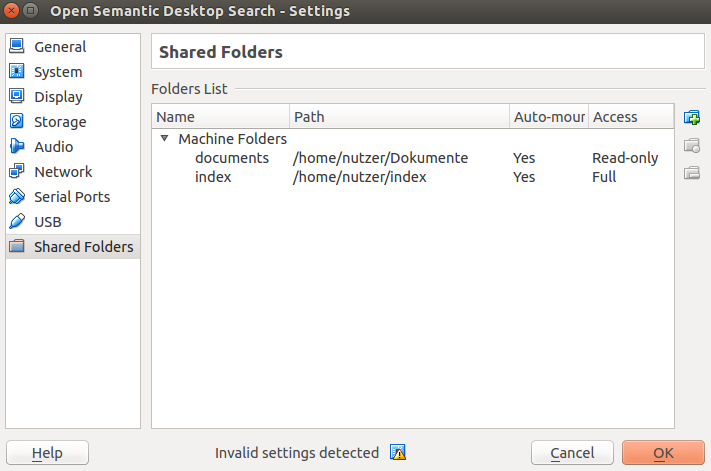

# Open Semantic Search Appliance (search server VM)

## Search engine as virtual appliance or preconfigured virtual machine with a open source search server for teams

The **free software *Open Semantic Search Appliance*** is the *Open Semantic Search* **all in package** (including Solr search server, open source tools and search user interfaces) as **virtual machine image** for **teams** having a virtual machine host like a Windows server or Linux server running a virtual machine host like Virtual Box, VMWare, QEmu or KVM for [search, analysis and document mining in many documents](../../../search)
## Installation of the virtual machine

* [Download the virtual machine image *Open Semantic Search Appliance*](../../../../download#appliance)
* Start *Virtual Box*
* In the menu "File" start the option "Import Appliance".
* Choose the downloaded appliance file and start the import

## Configuration of document folders

Edit the settings of the new virtual machine (choose the virtual machine in the left sidebar and click the "settings" button in the top bar).

Add **shared folders** with **documents**:

You can add one shared folder or multiple shared folders pointing to local folders on your harddisk to point to your documents, that should be indexed, searched and analysed.

Activate the option *Auto-mount*.

This folder(s) can be set read only, so you can not accidently delete important documents from inside the virtual machine.

If you don't want to use Virtual Box shared folders for access to the documents or if you use another virtualization solution than Virtual Box, you [setup (mount) network fileshares within the virtual machines config](#mount).

## Processor and RAM settings

If available, set more RAM than the preconfigured *4096* MB.

If you have multiple free processors, give the virtual machine access to more then the preconfigured two processors in the config tab *System / Processor* to enable parallel processing so the indexing and analysis processes will be much faster.

## Network configuration

Give your clients access to the IP and port 80 of the virtual machine. Therefore you can for example set port forwarding to port 80 of the guest in "extended network settings" of the virtual machine.

## External index (optionally)

If you have very much data so some douzen Gigabytes for the index within the virtual machine will be too few space and you don't want to increase the VM image size, you can store the index in a directory or filesystem outside the Virtual Machine.

Therefore add a shared folder named `index` (activate the option *Auto-mount*).

Don't set this folder to read only, since the search engine has to store the index in it.

Create a directory `tmp` inside this shared folder `index`.

## Index documents

### Web user interface

You can use the datasources web user interface to add paths you added before in Virtual Box shared folder config like /media/sf\_documents and click on "Index" after saving.

### REST-API

You can use the [REST-API to index a folder or files:

For example call
`http://search-vm.localdomain/search-apps/api/index-dir?uri=/media/sf_documents`
in your browser or from the commandline with Curl (use the domain name or the IP-address of your virtual machine instead of *search-vm.localdomain*) to index all documents in the configured shared folder *documents*.

### Command line tools

Or login as root on the virtual machine console and use the [command line tools](../../cmd):

`opensemanticsearch-index-dir */media/sf\_documents/*`
## Access to search user interface

* Launch the search user interface by opening http://vm.localdomain/search with your browser. Use the domain name or the IP-address of your virtual machine instead of *search-vm.localdomain*

## Search, explore and analyse

* Use [powerful research tools for search, exploration, analysis, text mining and document mining](../../../search)

## Additional document directories or file shares

If you want to mount index additional file shares, you have to make them available to the virtual machine.

### Virtual Box shared folders

If you use Virtual Box you can configure shared folders, so the search engine can access the files. Read only mode is enough to index this directories.
If you set to "auto mount" such shared folders are mounted in /media/sf\_*sharedfoldername* inside the virtual machine.

### Linux mount and fuse filesystems

Additionally you can mount each file systems Debian GNU/Linux can mount, for example a NAS, SMB, NFS, SSHFS, Amazon S3, Google drive and many other filesystems, file shares and file storage protocols.

Therefore use the console of the virtual machine to login as root (you have not to enter a password, since you have access to the virtual machine host) and mount some file shares using /etc/fstab as config file.

## Access

If you don't secure the used Apache webserver or this web application, all who can access your computers IP have full access to the search engine and so access to all indexed contents, too.

With its API and web apps in `/search-apps` it is possible to index data or tag documents.

If you dont want to secure the whole Apache web server (for example limit access to localhost or add a password protection with htaccess), you should limit access to the search in `/etc/solr-php-client-ui/apache.conf` and limit access to the REST-API and web apps in `/etc/opensemanticsearch-django-webapps/apache.conf` ...

The initial password for the Django admin interface (i.e. for adding tags that are usable for documents tagging) is `live`

Since as admin you have control of the virtual machine host and you have full access to the VMs data and so there is no root password, just login as root without password on the virtual machine console.

You can set a root password with `passwd root` and install the package *openssh-server* with `apt-get install openssh-server` to be able to login over the net, too.

## Roadmap

Please [donate](../../../../donate) for more time to work on it and release earlier:

### HTTPS out of the box

Add HTTPS without manual config of Apache webserver.

### Web interface for config

The configuration is based on config files in `/etc/opensemanticsearch`
Maybe some day there will be a web interface for that.](../../rest-api)