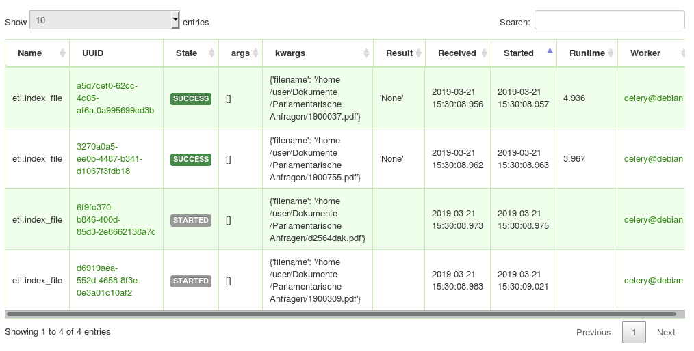

# Task queue management

The task queue for the ETL workers is managed by *Celery* in a [*RabbitMQ*](https://packages.debian.org/de/bullseye/rabbitmq-server) queue.

## Command line interface (CLI)

So you can use the [queue management tools of *RabbitMQ*](https://docs.celeryproject.org/en/stable/userguide/monitoring.html#rabbitmq) and [queue management tools of *Celery*](https://docs.celeryproject.org/en/stable/userguide/monitoring.html).

## Status of file imports in search user interface

If this feature is not disabled by config, the status of file imports and OCR tasks is shown in the search user interface:

While the file import is running, you can yet search by filenames and prioritize the import of certain files by click on "*Prioritize import*".

## Web user interface for task management (Flower web UI)

You can monitor and manage the ETL task queue for document processing by [*Celery Flower*](https://docs.celeryproject.org/en/stable/userguide/monitoring.html#flower-real-time-celery-web-monitor) web user interface (UI):

A link to the *Flower* instance on your host (f.e. `http://localhost/flower`) is available in the search user interface in the menu "*Datasources*" as "*Show running and open imports and analysis tasks (ETL tasks)*".

