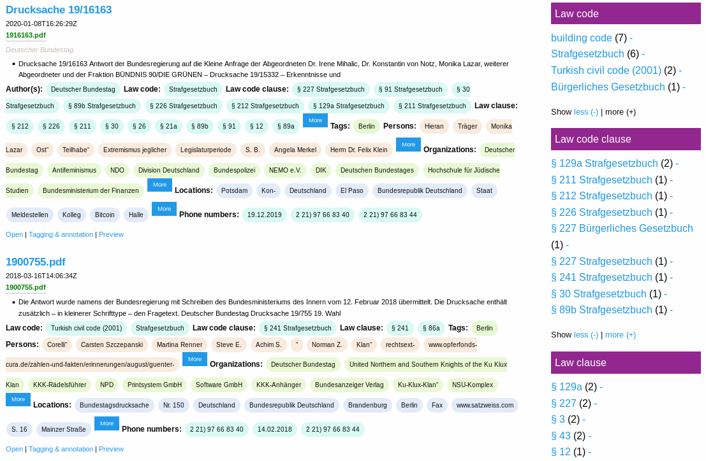
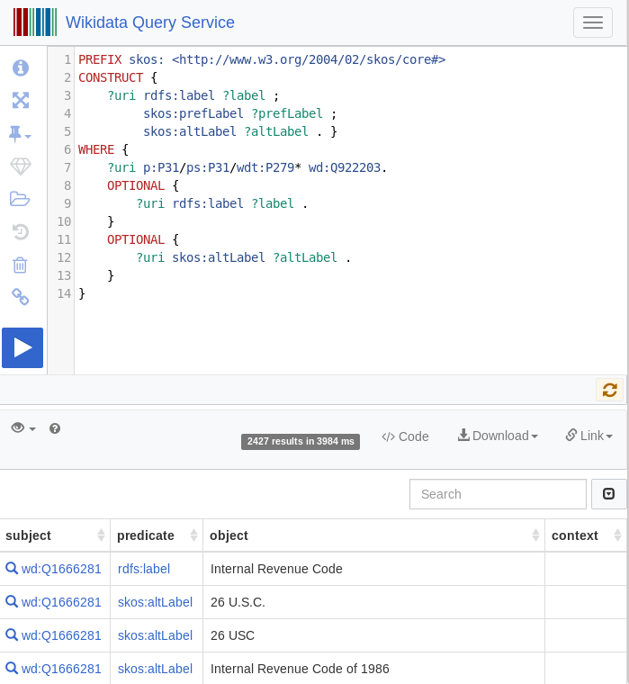

# Automatic extraction of law codes and law clauses


How to extract, analyze, sort, structure and filter your documents and large document collections by **legal codes** and **law clauses** with free **Open Source natural language processing (NLP) tools** and **Open Data legal thesaurus** extracted and imported from **Wikidata knowledge graph**.

## Aggregated overviews and interactive filters (Faceted search) for your documents by legal codes and law clauses


Open Semantic Search provides law code extraction, analysis, aggregated overviews and interactive filters (Faceted search) for your documents by extracted law codes and law clauses out of the box.



This is based on analysis results of specialized Open Source ETL plugin for analysis of law clauses by extraction of text patterns by regular expressions (regex) and law codes by dictionary based named entity extraction and entity linking of an integrated legal ontology of law codes, a domain knowledge SKOS thesaurus extracted from the open knowledge graph / ontology Wikidata (open data):


# Open Legal tech: How to extract legal codes and law clauses by Open Source NLP tools and Open Data from Wikidata


This documentation describes how this legal codes and law clause extraction works in detail and how you can [blacklist custom law code labels or aliases, which are too ambiguous](#blacklist) in your documents context.


## Open Source ETL plugin for textmining of structured legal data from full text of documents


The [Open Semantic ETL (extracts documents full text to more structured data and search index)](https://github.com/opensemanticsearch/open-semantic-etl) open source [plugin "extract law"](https://github.com/opensemanticsearch/open-semantic-etl/blob/master/src/opensemanticetl/enhance_extract_law.py) is based on and combines multiple natural language processing (NLP) and textmining methods to extract, aggregate and normalize **law codes** and **law clauses** in multiple variants from the full texts of your documents:


## Extract law clauses by Regex (text pattern based extraction)


One main step is to extract law clauses like *§ 123* from the document text with a [Regular expression](https://en.wikipedia.org/wiki/Regular_expression) for the [Python Regex library *re*](https://docs.python.org/3/library/re.html).


## Extract law codes by thesaurus (dictionary based named entity extraction)


Another main step is to extract law code labels (f.e. "Civil code", "Strafgesetzbuch" or "Bürgerliches Gesetzbuch" or their aliases like "STGB" or "BGB") by our integrated law codes thesaurus.

This Simple Knowledge Organization System (SKOS) standard based thesaurus of law codes is an export of results of a [Wikidata SPARQL query for labels, synonyms and alternate labels of law codes](#sparqlquery) extracted from the Wikidata knowledge graph / ontology.

Since this SKOS thesaurus of law codes is preconfigured in [Ontology Manager](../../datamanagement/ontologies) (Python/Django UI for import data from SPARQL/RDF to Solr Texttagger) of the semantic search engine, this step was yet done by the ETL plugin for dictionary/thesaurus/ontology based extraction of labels of entities from full text by [OpenRefine Reconciliation API Standard](https://reconciliation-api.github.io/specs/0.1/) based [Open Semantic Entity Search API](https://github.com/opensemanticsearch/open-semantic-entity-search-api), Solr providing a REST-API for managing this entities with labels and entity IDs/URIs in a Solr index and [Solr text tagger](https://lucene.apache.org/solr/guide/8_0/the-tagger-handler.html), a Finite State Transducer (FST) based dictionary matcher REST-API to extract this indexed labels / substrings from full text.


## Open data from Wikidata knowledge graph


For getting the [open data list / thesaurus of law code labels and their alternate labels/aliases](https://github.com/opensemanticsearch/open-semantic-search-apps/blob/master/var/opensemanticsearch/media/ontologies/law_codes.rdf) we [query, extract and import Open Data of entities from Wikipedia from the the free universal knowledge graph Wikidata](../../datamanagement/opendata/wikidata) by the following **SPARQL query** returning RDFS labels and SKOS thesaurus alternate labels:


```

PREFIX skos: 
CONSTRUCT {
 ?uri rdfs:label ?label ;
 skos:prefLabel ?prefLabel ;
 skos:altLabel ?altLabel .
}

WHERE {

 ?uri p:P31/ps:P31/wdt:P279* wd:Q922203.

 OPTIONAL {
 ?uri rdfs:label ?label .
 }
 OPTIONAL {
 ?uri skos:prefLabel ?prefLabel .
 }
 OPTIONAL {
 ?uri skos:altLabel ?altLabel .
 }
}

```


So we get relevant law code labels like "Strafgesetzbuch" (German penal code) and aliases or alternate labels like "STGB" which is an abbreviation for "Strafgesetzbuch" (German penal code).


## Combine law codes and law clauses to law code clauses


As last main step both approaches are combined:

The law plugin checks if there are combinations of extracted law codes with extracted law clauses, so we get law code clauses like "§123 civil code" for the facet "Law code clause".


## Normalization of law codes


Alternate names are normalized to the preferred label of the entity / law code, so f.e. *§123 STGB* in a text will be added to the interactive filter in a normalized form "§123 Strafgesetzbuch", so if you overview or filter by the facet/interactive filter like "Law code", you will get documents with all variants.


## Reduce false positives


Some alternate names of law codes are too general or too ambiguous.

For example the alias "CC" of the law code "Civil code" is used with another meaning in many other contexts (f.e. in many emails as abbreviation of "carbon copy (CC)" function).

So this alias *CC* is listed in the blacklist [`/etc/opensemanticsearch/blacklist/enhance_extract_law/blacklist-lawcode-if-no-clause`](https://github.com/opensemanticsearch/open-semantic-etl/blob/master/etc/opensemanticsearch/blacklist/enhance_extract_law/blacklist-lawcode-if-no-clause) so the law code "Civil code" will be only added to the facet "Law codes" if the occuring alias CC is used combined with a law clause like *§ 123 CC* or *CC § 123* but not if only the alias "CC" is in the text, while if the preferred label "Civil code" is in the text without such a law clause, it will be added to the facet "Law codes", because this label is not blacklisted.
